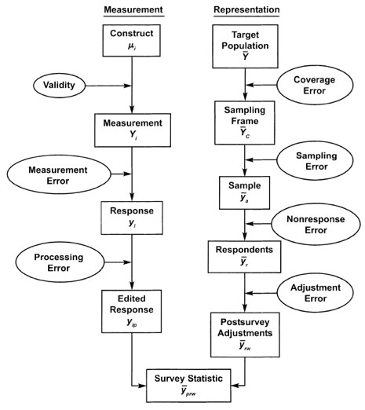

# Introduction {#intro}

Since the mid-to-late 1990s when internet access first became widely available to the general public, the share of survey research conducted online has grown dramatically. Most of these surveys have not relied on random samples of individuals drawn from reasonably complete population frames but rather on samples of individuals who self-selected into eligibility by choosing to join a panel or clicking on an online advertisement. At first, these surveys were primarily used for market research, but as the costs of probability-based surveys have risen and response rates have declined, they have become more and more common in both academic survey research and public-opinion polling  [@callegaro2014]. 

The American Association for Public Opinion Research (AAPOR) has attempted to address the issue of quality in nonprobability survey samples. It has produced task force reports on online opt-in panels [@baker2010], nonprobability surveys more broadly [@baker2013], and a report entitled "Evaluating Survey Quality in Today's Complex Environment" that included guidance on assessing the quality of nonprobability samples [@baker2016]. The consistent theme of these reports has been that nonprobability methods are comprised of a wide variety of disparate practices, the appropriateness of which will depend on the specific research application. There is little in the way of specific guidance that could be applied broadly to nonprobability research writ large.

Over the years, a number of studies have compared the accuracy of different nonprobability samples to each other and to probability-based surveys across a variety of population benchmarks. A study conducted in 2004 comparing a random digit dial (RDD) telephone survey, a probability-based web survey, and seven different nonprobability samples found that the nonprobability samples were consistently less accurate than the probability-based surveys and that the overall level of bias varied widely between samples from different vendors [@yeager2011]. A 2013 study conducted by the Advertising Research Foundation compared samples from 17 different online sample vendors and an RDD telephone survey and also found that the RDD sample showed the lowest bias across a variety of benchmarks. Again, the accuracy of the nonprobability samples varied considerably from vendor to vendor [@gittelman2015]. A report by Pew Research Center compared 9 online nonprobability samples and the Center's probability based American Trends Panel (ATP) across 24 different government benchmarks. In this study, one nonprobability sample proved consistently more accurate than both the ATP and the other samples, though again, there was substantial variation in the level of accuracy across the nonprobability sample vendors [@kennedy2016]. While these studies have succeeded at measuring the magnitude of error across nonprobability sample sources and demonstrated that it is at least possible for nonprobability samples to produce accurate survey estimates, they have been less successful at explaining why some samples perform better than others. 

A major source of difficulty has been the fact that most of this research has attempted to apply the tools and frameworks that have evolved over time for the study of probability-based methods to the study of nonprobability methods. In general, they have not proven helpful. It is worth considering why this might be the case.

It is certainly not because the field is unfamiliar with the potential risks associated with the use of nonrandom survey samples. The 1936 _Literary Digest_ poll -- that famously predicted Alfred Landon would defeat Franklin Roosevelt 54% to 41% -- remains the go-to cautionary tale about the dangers of nonrandom sampling [@lusinchi2012]. Polling by George Gallup that same year proved more accurate. Gallup attributed this success to the ostensibly more scientific method of quota sampling in which interviewers select respondents purposively to obtain a pre-specified number of interviews among certain geographic and demographic groups [@lusinchi2017]. However quota sampling was also discredited after a report by the Social Science Research Council identified it as one of many causes behind the spectacular failure of the polls to correctly predict the 1948 election  -- an event memorialized in the famous photos of a newly elected Harry Truman holding up a copy of the Chicago Daily Tribune with the headline "Dewey Defeats Truman" [@mosteller1949; @mosteller2010]. Subsequently, most public opinion and social science research transitioned to probability-based methods, for which a more robust statistical theory had already been developed, and which had already been adopted by the federal government for its own research [@converse1987a; @hansen1953; @neyman1934]. 

That theory, which has come to be known as design-based inference, requires that every unit in the population has a known, nonzero probability of selection. When survey samples are randomly selected in this way, there are strong mathematical guarantees that over repeated sampling, survey samples will match the population distribution with respect to any population characteristic provided that it can be measured accurately [@horvitz1952]. Over the intervening years, the vast majority of statistical and methodological research into survey sampling and data collection has been premised on the idea of random sampling. Model-based approaches to survey sampling and inference that do not fundamentally depend on random selection have been developed, but even modelers recommend random sampling because it protects the validity of model-based estimates against misspecification [e.g. @little2007; @valliant2000 pp. 19-21]. 

During the 1980s and 1990s, the Total Survey Error (TSE) framework became the dominant research paradigm in survey methodology. The strength of the TSE approach lies in its recognition that there are multiple sources of error in surveys besides variability from random sampling. It categorizes error in survey estimates according to the stage in the survey process during which the error was introduced, which makes it possible to isolate, identify, and eliminate or reduce specific causes of survey error. It identifies noncoverage, when some members of the population have no chance of being selected, and nonresponse, the failure of some portion of sampled units to complete the survey, as the primary sources of systematic selection bias in survey estimates [@biemer2010; @groves1989; @groves2009; @groves2010]. Under the TSE framework, data quality depends most on the _process_ used to produce a sample rather than characteristics of the sample itself. Noncoverage and nonresponse describe features of the data collection process with the potential to undermine the guarantees provided by random selection - also a characteristic of the data collection process.  Although rarely achieved in practice, the goal is to make the survey process hew as closely as possible to the ideal of perfect random selection in order to reduce or eliminate the need to rely on statistical models or untestable assumptions in analysis after the data has been collected.

This digression through the history of survey research is meant to illustrate just how deeply the idea of random sampling is embedded in the field of survey methodology. In fact, the very premise of Jerzy Neyman's foundational paper describing stratified random sampling is to contrast random and purposive sampling. In it, he concludes "...the only method which can be advised for general use is the method of stratified random sampling" [@neyman1934 pp. 588]. Since the field's inception the the solution to the kinds of problems observed in 1936 and 1948 _is_ randomization, not a better form of purposive selection. That would be like trying to improve the design of a two-legged stool. Better to just add a third leg. 

The 2013 AAPOR report on nonprobability sampling acknowledges the underlying problem when it states in its conclusion: 

> If non-probability samples are to gain wider acceptance among survey researchers there must be a more coherent framework and accompanying set of measures for evaluating their quality. One of the key advantages of probability sampling is the toolkit of measures and constructs (such as TSE) developed for it that provides ways of thinking about quality and error sources. Using that toolkit to evaluate non-probability samples is not especially helpful because the framework for sampling is different. Arguably the most pressing need is for researched [sic] aimed at developing better measures of the quality of non-probability sampling estimates that include bias and precision [@baker2013 pp. 109].

This dissertation attempts to address the absence of a coherent framework for evaluating the error properties of nonprobability samples, specifically the matter of selection bias that can arise in the absence of random sampling.

## Problems with the Total Survey Error framework
\sectionmark{Problems with the TSE framework}

Figure \@ref(fig:tse) depicts the way in which the TSE framework classifies survey error according to the stage in which it enters the survey process. It distinguishes between errors of measurement which relate to the ability to accurately record the characteristics of individual units, and errors of representation which arise because of differences between the composition of a sample and the target population. TSE further distinguishes between errors that are random (variance) and those that are systematic (bias) [@groves1989]. This research is focused systematic errors of representation, more commonly known as selection bias. 

```{r tse, warning = FALSE, message=FALSE, echo=FALSE, fig.align='center', fig.cap="Components of error under the Total Survey Error framework \\citep{groves2009}", fig.scap="Components of error under the Total Survey Error framework"}

```

The procedure for moving from the full target population to a survey statistic describing that target population consists of a set of sequential and conceptually distinct steps. The first step is constructing a sampling frame that contains as much of the target population as possible. If units are omitted from the frame, the magnitude of bias depends on how different those units are and their share of the population. The second step is selection from the sampling frame. As long as this is done randomly, it should not introduce any new systematic errors, although different procedures will vary with respect to statistical efficiency. Step three involves interviewing the selected units. If the chosen data collection procedure does not successfully interview all of the sampled units, the level of bias in a statistic will depend on how many are missing and how distinct they are with respect to the outcome variable. Finally, there is adjustment error. This step involves any weighting or statistical modeling aimed at correcting biases introduced at earlier phases of the process. The goal of the TSE framework is to minimize the need for post-survey adjustment that requires making assumptions about the nature of the missing data [@kalton2003; @little2002]. These assumptions are discussed in detail in Chapters \@ref(ch3) and \@ref(ch4) of this dissertation. 

The framework is elegant and has proven enormously useful for design-based survey research. In theory, if one were able to devote sufficient resources to obtaining a sampling frame with perfect coverage and implement a data collection procedure that resulted in perfect response, one could entirely eliminate systematic selection biases. Although this almost never possible in practice, it sets a standard against which different survey designs can be evaluated and permits survey designers to weigh the advantages and disadvantages of different design features in a principled and coherent way. 

Even for model-based sampling procedures such as balanced sampling or cube sampling, the TSE framework is helpful. These methods generally involve the selection of a finite sample from a complete population frame. The selection algorithms are all based on well defined probability models and generally involve a great deal of randomization, even if they are not technically 'design-based'. Complete coverage and response helps ensure that the modeling assumptions that underpin these methods remain valid [@deville1998; @deville2000; @deville2004; @little2007; @sarndal1992; @valliant2000]. 

In contrast, the kinds of nonprobability samples that are the subject of this thesis, online opt-in samples in particular, differ from more traditional samples in important ways that make the TSE framework inapplicable. First, there is generally no pretense or even aspiration to complete coverage of the population. Even panels that contain millions of individuals contain only a tiny fraction of the whole population. It is tempting to think of a panel as a sort of sampling frame with very poor coverage [e.g. @fahimi2015]. This is not necessarily wrong, but it is also beside the point. Increasing the fraction of the population that is included in a panel to a level that could be said to reduce the risk of coverage bias, as the TSE framework would recommend, is simply not within the set of possible actions that could be taken to improve data quality. Instead, efforts are made to recruit diverse kinds of individuals and make sure that there are no specific _types_ of person missing from the panel, but this moves away from the TSE conception of coverage and back toward purposive selection and raises the question of how to determine what the relevant types of people would be. 

Second, the process by which individuals are selected for a specific survey does not typically resemble the well-defined procedures of design-based or model-based survey sampling. The actual algorithms are usually considered proprietary, and there is no set of standard procedures that are consistently applied across vendors. Moreover, there is often not any sort of finite sample. Usually, there is a set of quotas specifying a desired distribution of respondent characteristics, and panelists are continuously directed to the survey until the criteria are met. Often panelists are not even selected for a specific survey but are routed to one of many currently fielding surveys based on algorithms designed to efficiently allocate sample [@brigham2014; @gittelman2015]. This effectively negates the conceptual utility of nonresponse error as there are no clear groups of people who can be coherently defined as respondents and nonrespondents. Even in the instances where a finite sample is selected, there is no way to disentangle bias that occurs because some people choose not to participate from the bias that occurs because panel membership is self-selected. The issues of panel recruitment and sampling are discussed more in Chapter 2, Sections \@ref(recruitment) and \@ref(sampling). 

The tidy, linear depiction of representation error in Figure \@ref(fig:tse) becomes an intractable knot when applied to the typical nonprobability survey. It is not possible to separate bias due to coverage, sampling, and nonresponse in any meaningful way. A TSE analysis of nonprobability surveys would effectively recommend that they convert themselves in to probability-based surveys. Again, this might be desirable from a statistical perspective, but it is beside the point. 

Perhaps the most fundamental disconnect between the TSE framework and nonprobability survey sampling is that TSE seeks to eliminate the need to rely on models and assumptions. The power and appeal of random sampling is that, when unthreatened by problems such as nonresponse and noncoverage, one need not know anything in particular about the target population other than that it has been fully enumerated. Data quality is determined by the process that generated the data, and strong assumptions are unnecessary for analysis. Once the data has been collected, analysts are free to conduct their analyses as they see fit as long as they account for design features.

For nonprobability samples, attempting to minimize or eliminate strong assumptions is to make a category error. There is no avoiding strong assumptions either in practice or in principle. While the data collection process is of critical importance, there is no mechanism that provides the same sorts of theoretical guarantees as random selection. Instead, the validity of population inferences depends entirely on a set of modeling assumptions that explain the relationship between the realized sample and the target population. Rather than minimize assumptions, an error framework for nonprobability sampling should instead shine a spotlight on them. It should make it easy for analysts to know what assumptions they are making and give them the analytical tools to assess whether or not those assumptions are reasonable.

## A framework inspired by causal inference

Fortunately, survey research is not the first field that has had to grapple with problems of nonrandom data. The field of causal inference holds a great deal in common with survey inference. When trying to measure the effect of some treatment such as a drug, medical procedure, or social program, the field of causal inference has also relied on randomization to provide valid statistical inferences. Just as survey research has relied on random selection to ensure that sampled and nonsampled units are comparable, causal inference has relied on random assignment to ensure that treatment and control groups are comparable.

However, there are instances where random treatment assignment is not feasible, either for ethical reasons or because the treatment is outside the control of the researcher. For instance, political scientists who wish to measure the effects of Latino immigration into communities on support for presidential candidates have no way of randomly assigning different levels of immigration to different communities and measuring the difference [e.g. @newman2018]. For these sorts of instances, statisticians have developed a framework clarifying what conditions must hold in order to make valid causal claims on the basis of observational data. It happens that the conditions that must hold in order to conduct causal inference with observational data are very similar to the conditions that are necessary to draw valid population inferences from nonprobability survey samples. 

Building on the similarities between these fields, this dissertation proposes an alternative framework for considering selection bias in nonprobability survey samples and probability-based samples with noncoverage or nonresponse.

Chapter \@ref(ch2) of this dissertation elaborates on the parallels between causal inference and survey inference. Drawing on these parallels, it proposes a typology for different kinds of selection bias that is based on causal inference principles. Specifically, it describes bias not in terms of defects in the data collection process but in terms of the validity of assumptions about the relationship between a survey sample and the target population conditional upon a proposed model and set of covariates. This proposed framework is appropriate both for nonprobability surveys and probability-based surveys with nonresponse or noncoverage.

Specifically, the framework classifies selection bias as attributable to problems of exchangeability, which requires that a model relating sample to population must condition all of the covariates that are necessary to make sampled and nonsampled units equivalent [@greenland1986; @greenland2009; @little2002; @rosenbaum2002; @rubin1974]; positivity, which requires that all of the necessary types of respondent defined by the model covariates are represented in the sample [@hernan2006;  @petersen2012]; and composition, which requires that the distribution of the model covariates must match the their distribution in the larger target population. After providing a conceptual description of these types of bias, Chapter \@ref(ch2) proceeds with a critical review of current practices in nonprobability sampling and estimation from the perspective of the causal framework and discusses their implications for reducing or increasing selection bias in survey estimates.  

The causal framework proposed in Chapter \@ref(ch2) has spoken to a clear need in the survey community. It was first presented as part of a special session on the the future of survey research at the 2016 AAPOR conference and published in the associated special issue of Public Opinion Quarterly (POQ) [@mercer2017]. It has been subsequently presented at conferences focused on nonprobability survey research sponsored by the European Survey Research Association and the National Institute for Statistical Science. It has been presented to audiences as diverse as the Advertising Research Foundation's 2017 FORECASTxSCIENCE conference and the 2018 Conference of the American Association for the Advancement of Science. It was most recently presented at the DC chapter of AAPOR's POQ Special Issue Conference. In each of these venues these ideas have provoked thoughtful discussion and commentary from statisticians, pollsters, market researchers, and survey methodologists who felt that the standard analytic toolkit did not sufficiently address their needs. 

Chapter \@ref(ch3) further develops the causal framework for selection bias by providing a more formal, mathematical description of these biases based on conditional probabilities. It goes on to demonstrate that total selection bias can be decomposed into additive components associated with exchangeability, positivity, and composition respectively. When an appropriate reference sample is available, these components can be estimated conditional on a set of chosen covariates. 

Using Bayesian Additive Regression Trees (BART) [@chipman2010], the magnitude of each type of bias is estimated for six measures of civic engagement that were measured on 10 different nonprobability samples commissioned by Pew Research Center. These include the 9 nonprobability samples analyzed in the study by @kennedy2016 and a survey that was sampled via Amazon's Mechanical Turk that used the same questionnaire. It finds that exchangeability bias from unobserved confounding variables is generally the largest source of bias for individual estimates. 

Chapter \@ref(ch4) compares two doubly-robust approaches to survey estimation with singly-robust approaches based on propensity weighting (PW) and outcome regression (OR). Doubly-robust estimation involves fitting separate regression models predicting both sample inclusion and the outcome variable of interest. As long as one or the other model is correctly specified, the resulting estimates will be asymptotically consistent [@bang2005; @kang2007; @robins1994]. The doubly-robust estimators considered are outcome regression with a residual bias correction (OR-RBC) and outcome regression with a propensity score covariate (OR-PSC) [@kang2007]. All four approaches are implemented using BART, making them similar to methods evaluated by @tan2018.

The analysis is conducted using the same 10 samples and outcome variables as in Chapter \@ref(ch2). Because many of these variables are known to suffer from unobserved confounding, none of the estimators entirely eliminate selection bias. We find that OR-RBC tends to have the lowest bias, variance, and RMSE, with PW only slightly worse on all three measures. OR and OR-PSC also perform similarly but result in larger variances and appear more likely than PW and OR-RBC to inflate rather than reduce bias. 

The nonprobability survey data analyzed in Chapters \@ref(ch3) and \@ref(ch4) are publicly available for download from Pew Research Center at http://www.people-press.org/datasets/2015/. The code used to conduct these analyses can be found on GitHub at https://github.com/awmercer/fpbb-inference and in Appendix \@ref(ap-code). This repository is accompanied by a preliminary R package called `bestimate` (https://github.com/awmercer/bestimate) that aims to permit others to conduct the same kinds of estimation and bias decompositions with BART that are employed in this dissertation. The dissertation itself is written in `bookdown`, and can also be found on GitHub at https://github.com/awmercer/amercer_dis.


